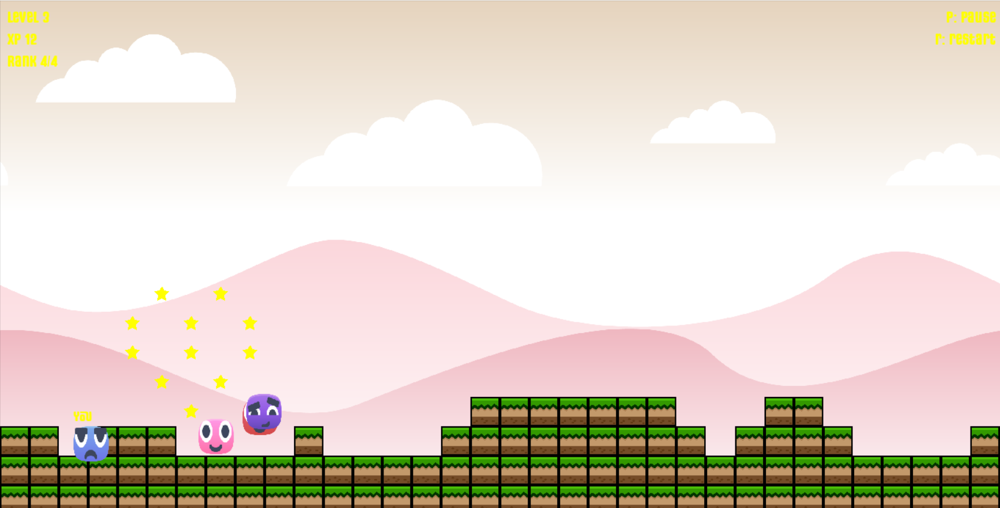

# Starlight 2D Runner 
 [](https://www.python.org/) [](https://www.pygame.org/)

---

<p align="center">
  
</p>

---

##  About

**Starlight 2D Runner** is a procedurally generated, endless runner crafted in pure Python using Pygame. Race across vibrant, layered landscapes, leap over tile-block obstacles, collect shining stars, and unlock emotional character expressions as you climb through the ranks!

##  Key Features

* **Procedural Terrain**: Ground built from `tile_block.png` stacks for unique platform layouts each run.
* **Multi-layer Parallax**: Four background layers (`layer1.png`–`layer4.png`) create depth beneath minimalist clouds.
* **Expressive Faces**: Characters change mood via `face_happy.png`, `face_angry.png`, `face_neutral.png`, etc.
* **Collectibles**: Grab the yellow `star_collectible.png` to boost XP and score.
* **Dynamic Difficulty**: Speed gradually increases with your level—stay sharp!
* **Audio Cues**: Jump sounds, star chimes, and level-up alerts fuel the experience.

## ⚙ Installation

```bash
git clone https://github.com/yuvrajnag/Starlight-2d-runner.git
cd Starlight-2d-runner
python3 -m venv venv           # create venv (optional)
source venv/bin/activate      # Windows: venv\\Scripts\\activate
pip install -r requirements.txt
```

##  How to Play

1. **Start the Game**:

   ```bash
   python code/hiro.py
   ```
2. **Controls**:

   * `Space` or `Up Arrow`: Jump
   * `Down Arrow`: Slide
   * `P`: Pause
   * `R`: Restart
3. **Scoring**:

   * Each star = +1 XP
   * Survive longer to increase Level and Speed
   * Aim for top **Rank** by outrunning AI rivals

##  Assets Overview

| Category     | Filenames                                                                         |
| ------------ | --------------------------------------------------------------------------------- |
| Background   | `layer1_sky.png`, `layer2_hills.png`, `layer3_mountains.png`, `layer4_clouds.png` |
| Ground Tiles | `tile_block.png`                                                                  |
| Characters   | `player_face.png`, `ai_face1.png`, `ai_face2.png`                                 |
| Faces/Emotes | `face_happy.png`, `face_angry.png`, `face_neutral.png`                            |
| Collectibles | `star_collectible.png`                                                            |
| Audio        | `jump.wav`, `star_chime.wav`, `level_up.wav`, `bgm.ogg`                           |
| Fonts        | `starlight_font.ttf`                                                              |

Swap these in `assets/` to theme your own vision!

## Project Structure


Starlight-2d-runner/ <br>
├── assets/ &nbsp;&nbsp;&nbsp;&nbsp;&nbsp;&nbsp;&nbsp;&nbsp;&nbsp;&nbsp;&nbsp;&nbsp; # .png, .wav, .ogg, .ttf <br>
├── code/   &nbsp;&nbsp;&nbsp;&nbsp;&nbsp;&nbsp;           &nbsp;&nbsp;&nbsp;&nbsp;&nbsp;&nbsp; # Python scripts <br>
 │   &nbsp;&nbsp;&nbsp;&nbsp;&nbsp;&nbsp;&nbsp;&nbsp;└── hiro.py  &nbsp;   # Entry point <br>
└── README.md <br>


##  Contributing

Issues, feature requests, and pull requests are welcome! Let's launch it into the cosmos together.

---

##  Asset Credits

Game assets (sprites, tiles, backgrounds) are courtesy of **Kenney** from [kenney.nl/assets](https://kenney.nl/assets). Thank you for these fantastic free resources!

---

##### Built with ❤️ by **yuvrajnag** — reach me on GitHub: [@yuvrajnag](https://github.com/yuvrajnag)
